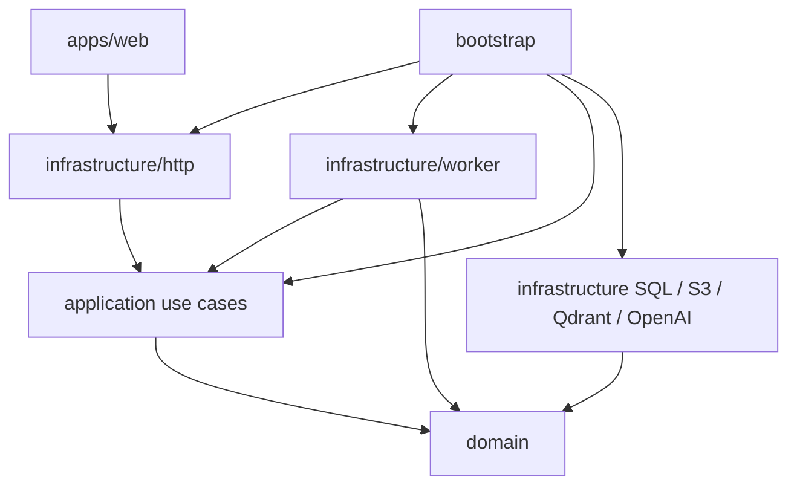
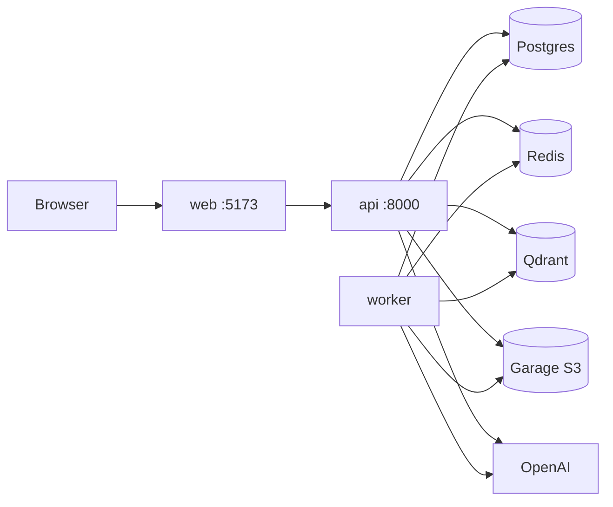
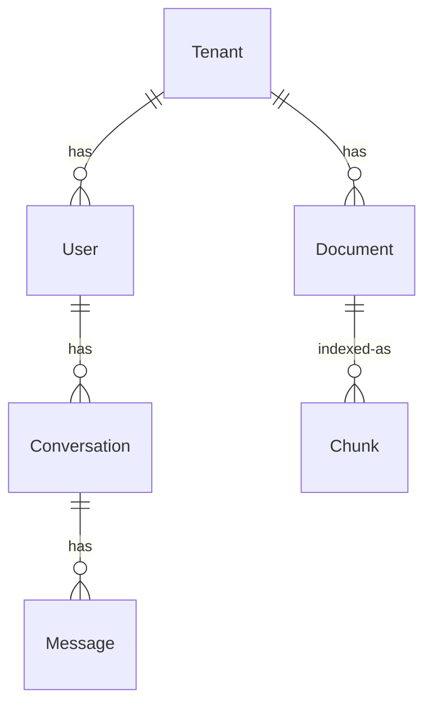

# Architecture Spine — AI-RAG

## Design Paradigm

Hexagonal (ports and adapters) [ADOPTED].

| Hexagon | Directory |
| --- | --- |
| Domain — entities, value objects, errors, port interfaces | `apps/api/src/app/domain/` |
| Application — use cases | `apps/api/src/app/application/` |
| Adapters — HTTP, SQL, S3, Qdrant, Celery, OpenAI | `apps/api/src/app/infrastructure/` |
| Composition root | `apps/api/src/app/bootstrap/` |
| UI features (not domain) | `apps/web/src/features/` |
| API client | `apps/web/src/api/` |

Implement slices in this order: identity-and-tenancy → documents → ingestion → retrieval → chat → rag-engineering → evaluation → production-hardening. Do not skip ahead of identity-and-tenancy.

## Invariants & Rules



**Dependency rule:** `domain` imports none of FastAPI, SQLAlchemy, Celery, Qdrant, LangChain, OpenAI, boto3, or web. `application` imports `domain` only. `infrastructure` may import `domain` and `application`. `bootstrap` wires everything. `apps/web` talks to the HTTP API only — it does not invent backend behavior.

### AD-1 — Hexagonal layers [ADOPTED]

- **Binds:** all
- **Prevents:** layered "service" modules that import FastAPI/SQLAlchemy/Celery/Qdrant/LangChain, and per-feature mini-apps with incompatible tenant or vector contracts
- **Rule:** New behavior is a domain type, a port, a use case, and an adapter. Do not add empty layer folders. One vertical slice at a time, in the order above. Validate untrusted input at HTTP and worker adapters, not in domain.

### AD-2 — Actor is the isolation key [ADOPTED]

- **Binds:** all tenant-touching use cases and retrieve/upsert/blob ports
- **Prevents:** `contextvars` tenant scope, loose `tenant_id` primitives, retrieve ports that take a bare tenant string, and `tenant_id` taken from an untrusted client field as the only filter
- **Rule:** Tenant isolation is a security boundary. Domain defines `Actor` (`tenant_id` + `user_id` as strings). Every use case that touches a tenant resource takes `Actor` and uses `actor.tenant_id` plus `assert_same_tenant`. Retrieve, upsert, and blob ports take `Actor` (or `actor.tenant_id` derived inside the use case — never a client-supplied tenant as the only argument). HTTP builds `Actor` from the verified JWT. The worker builds `Actor` from the job record. Use cases never take Request/Response. Roles stay off `Actor` until a slice needs them.

### AD-3 — Sync use cases and ports [ADOPTED]

- **Binds:** all product use cases and domain ports
- **Prevents:** async product use cases Celery cannot call, and HTTP-async vs worker-sync duplicate ports
- **Rule:** Product `execute()` methods and ports are sync. FastAPI product routes are `def`. SQLAlchemy uses a sync `Session`. Existing `GetReadiness.execute` may stay async until rewritten; it is not a product use case and is not a template for new work.

### AD-4 — Worker is an adapter [ADOPTED]

- **Binds:** documents, ingestion, evaluation, reindex, any later job
- **Prevents:** a Celery-owned ingest pipeline, a second lifecycle entity beside `Document`, and HTTP vs worker both calling `mark_processing`
- **Rule:** HTTP and the worker share the composition root and invoke the same use cases. `Document` is the only ingest lifecycle. Upload persists `pending` and enqueues; it does not call `mark_processing`. The worker runs `ProcessDocument`, which loads the document, asserts tenant, then `mark_processing` → extract/chunk/embed/upsert → `mark_ready` or `mark_failed`. Job JSON is flat strings: `tenant_id`, `user_id`, `document_id`. Domain and application never import Celery. Redis + Celery is the only async fabric.

### AD-5 — Thin RAG adapters [ADOPTED]

- **Binds:** ingestion, retrieval, chat, rag-engineering
- **Prevents:** a fat LangChain/LCEL `RagEngine`, and chat vs ingestion growing different chain styles
- **Rule:** Extract, chunk, embed, upsert, retrieve, and generate are domain ports. Application use cases orchestrate them. Infrastructure implements ports with `qdrant-client`, the official `openai` SDK, and owned extract/chunk code. LangChain is not the engine and is not imported from domain or application. First corpus format is PDF.

### AD-6 — Document bytes behind S3 [ADOPTED]

- **Binds:** documents, ingestion
- **Prevents:** API-local disk the worker cannot see, store-specific clients in domain/application, and key-shape splits
- **Rule:** Bytes go through one domain port named `DocumentBytes`. The adapter speaks the S3 API (endpoint, region, path-style, credentials from env). One bucket. Object key is `tenant_id/document_id/filename` (original filename, no extra `bytes` suffix). Garage is the intended Compose service for the documents slice — it is not in `compose.yaml` today. Production may point the same adapter at Amazon S3.

### AD-7 — One Qdrant collection, always filtered [ADOPTED]

- **Binds:** ingestion, retrieval, chat
- **Prevents:** collection-per-tenant, unfiltered search, mismatched payload/vector space, and ingest vs query using different embed models
- **Rule:** Collection name is `chunks`. Ingestion creates it if missing; retrieval and chat never create a different collection. Distance is Cosine. One embedding model from env (`OPENAI_EMBED_MODEL`) is used for both upsert and query-embed; vector size is that model's size. Point id is deterministic from `document_id` and `chunk_index` so re-ingest replaces. Payload fields (JSON types): `tenant_id` string, `document_id` string, `filename` string, `page` int (0-based), `chunk_index` int (0-based), `text` string (chunk body used for context). Every query filter includes `actor.tenant_id`. Cross-tenant retrieval is prohibited.

### AD-8 — Bearer JWT issued here [ADOPTED]

- **Binds:** identity-and-tenancy and every HTTP feature
- **Prevents:** cookie/CSRF vs bearer splits, Auth0 vs local-user splits, and forwarding tokens to the worker
- **Rule:** This API issues JWTs for local `User` rows, signed with `jwt_secret` from env. Claims include `user_id` and `tenant_id` as strings. The HTTP adapter verifies the signature and builds `Actor` from those claims. Web sends `Authorization: Bearer` and keeps the token in memory, not `localStorage`. Jobs do not carry the JWT.

### AD-9 — Shared schema, column isolation [ADOPTED]

- **Binds:** identity, documents, chat persistence, ingestion
- **Prevents:** schema-per-tenant, SQLModel vs raw psycopg vs per-slice ORMs, unscoped queries, and split table/status spellings
- **Rule:** One Postgres schema. Every tenant-owned table has `tenant_id` (string). Repositories always filter by `actor.tenant_id`. Persistence is SQLAlchemy 2.x + Alembic in infrastructure only. SQL table for documents is `documents`. Status values match the existing enum: `pending`, `processing`, `ready`, `failed`. Postgres row-level security is not required yet.

### AD-10 — Domain errors at the HTTP edge [ADOPTED]

- **Binds:** all HTTP adapters and the web client
- **Prevents:** use cases returning status codes, 404 vs 409 splits, and the React app inventing backend error semantics
- **Rule:** Domain raises `DomainError` subclasses. Missing resources raise `NotFoundError` (a `DomainError`). HTTP maps in this order: unauthenticated / missing / invalid token → 401, `TenantIsolationError` → 403, `NotFoundError` → 404, other `DomainError` → 409. Product `/api/v1` JSON is always `{data, error}`: success has a data object and `"error": null`; failure has `"data": null` and `error: {"code": "<STABLE_CODE>", "message": "<human>"}`. `/health` and `/ready` stay outside this envelope. Web handles loading, empty, and error states from those statuses plus `error.code` / `error.message`; it does not invent codes. Add `NotFoundError` next to the existing error types. Use cases never take Request/Response.

### AD-11 — Tenant corpus and grounded answers [ADOPTED]

- **Binds:** documents, retrieval, chat
- **Prevents:** owner-only vs all-members document ACL splits, answering over non-ready documents, and answers without sources
- **Rule:** Until a slice adds roles, every user in a tenant may use every document in that tenant. Retrieval and chat use only `ready` documents. Assistant messages MUST include `SourceRef` values (`document_id`, `filename`, `page`, `chunk_index`) for the chunks that grounded the answer. Empty retrieval → answer that it does not know; do not unground.

### AD-12 — Document mutation spans three stores [ADOPTED]

- **Binds:** documents, ingestion, retrieval, chat
- **Prevents:** SQL-only delete leaving Qdrant/S3 ghosts, and replace that upserts without dropping old points
- **Rule:** Delete and re-ingest are use cases that, under `Actor`, remove or replace the SQL row, the S3 key `tenant_id/document_id/filename`, and all Qdrant points for that `document_id` in `chunks`. Deterministic point ids make replace an upsert-after-delete of that document's points.

## Consistency Conventions

| Concern | Convention |
| --- | --- |
| Naming | Python: layer then capability (`application/documents`, `infrastructure/http`). Ports are protocols in `domain`. Use cases are classes with `execute`. Web: one folder per feature under `apps/web/src/features/`. |
| Types | Python type hints required. TypeScript `strict`. |
| IDs | UUID strings created in application/domain, not database serials. Same for users, documents, conversations, jobs. |
| Dates | UTC ISO-8601 in JSON. |
| Errors | `{data, error}` on `/api/v1`; mapping only in HTTP adapters (AD-10). |
| Auth | Bearer JWT; token in memory (AD-8). |
| Config | Environment only. Never commit secrets. |
| Tests | Each use case ships tests. Domain/application tests use in-memory fakes; no Docker. |
| Documents | Status machine lives on the entity: `pending` → `processing` → `ready` or `failed`. |
| Chunks | Page-aware chunks. Payload per AD-7. |
| Web | Do not invent backend behavior. Feature UI talks through `apps/web/src/api/`. |
| Slice order | identity-and-tenancy first; later slices assume `Actor` and JWT already exist. |

## Stack

Seed at authoring (2026-09-18). **Installed** = lockfile/compose today. **Intended** = add when the slice needs it; code then owns the pin.

| Name | Version |
| --- | --- |
| Python | >=3.12 (installed) |
| FastAPI | 0.115.12 (installed) |
| uvicorn | 0.34.2 (installed) |
| pydantic | 2.11.7 (installed) |
| pydantic-settings | 2.8.1 (installed) |
| Celery | 5.4.0 (installed) |
| redis (Python) | 5.2.1 (installed) |
| httpx | 0.28.1 (installed) |
| SQLAlchemy | 2.0.54 (intended) |
| Alembic | 1.20.0 (intended) |
| qdrant-client | 1.13.3 (intended; match compose Qdrant 1.13) |
| openai | 3.14.0 (intended) |
| boto3 | 1.43.98 (intended) |
| PyJWT | 2.14.0 (intended) |
| React | 19.1.0 (installed) |
| react-dom | 19.1.0 (installed) |
| react-router-dom | 7.6.1 (installed) |
| TypeScript | 5.8.3 (installed) |
| Vite | 6.3.5 (installed) |
| PostgreSQL | 16-alpine (installed) |
| Redis | 7.4-alpine (installed) |
| Qdrant | v1.13.2 (installed) |
| Garage | dxflrs/garage:v2.4.1 (intended Compose add) |

## Structural Seed



Compose **today:** `postgres`, `redis`, `qdrant`, `api`, `worker`, `web`. **Add with the documents slice:** `garage` (`dxflrs/garage:v2.4.1`) plus S3 env on `api` and `worker`. Secrets from env / `.env`. Cloud providers, managed S3, and orchestrators are not named here.



`Chunk` is a Qdrant point in `chunks`, not a Postgres table. Assistant `Message` carries `SourceRef` (AD-11).

```text
apps/api/src/app/
  domain/           # entities, VOs, errors, ports
  application/      # use cases by capability
  infrastructure/   # http, persistence, worker, s3, qdrant, openai, config
  bootstrap/        # composition root
apps/web/src/
  api/              # HTTP client
  features/         # UI by feature
```

## Capability → Architecture Map

| Area | Lives in | Governed by |
| --- | --- | --- |
| identity-and-tenancy | `domain` identity/tenancy + HTTP auth adapter + SQL User/Tenant | AD-2, AD-8, AD-9, AD-10 |
| documents | `domain` Document + `DocumentBytes` + SQL | AD-2, AD-4, AD-6, AD-9, AD-10, AD-11, AD-12 |
| ingestion | `ProcessDocument` + Celery adapter + extract/chunk/embed/upsert | AD-2, AD-3, AD-4, AD-5, AD-6, AD-7, AD-9, AD-12 |
| retrieval | retrieve port + Qdrant adapter | AD-2, AD-5, AD-7, AD-11 |
| chat | Conversation/Message + generate port + HTTP/web feature | AD-2, AD-5, AD-7, AD-8, AD-9, AD-10, AD-11 |
| rag-engineering | later adapters behind the same ports | AD-5, AD-7; hybrid/rerank deferred |
| evaluation | later jobs via same worker rule | AD-4 |
| production-hardening | env, RLS, OIDC, observability | Deferred |

## Deferred

| Item | Why it can wait | Revisit when |
| --- | --- | --- |
| Postgres RLS | Actor + column filter + Qdrant filter + key prefix are the isolation boundary | production-hardening |
| OIDC / cookies / refresh / revocation | Local JWT is enough for first slices | production-hardening, or identity needs an IdP |
| Roles / in-tenant ACL | AD-11: all tenant members share the corpus | a slice needs more than tenant membership |
| FastAPI 0.141 / Qdrant 1.19 / Vite 8 bumps | Installed seed; qdrant-client tracks compose 1.13 | a slice that needs a current feature |
| Hybrid retrieval, rerank, query rewrite | `docs/rag.md` already sequences them later | rag-engineering |
| Chat/generate model id | Config (`OPENAI_CHAT_MODEL`); not the vector schema | first generate adapter |
| PDF extractor library | Behind the extract port; format is PDF (AD-5) | ingestion slice |
| Kafka / domain events | Celery covers async jobs | a slice needs fan-out beyond one worker |
| k8s, managed Postgres, Amazon S3 topology | Compose is the named environment | production-hardening |
| Structured logging / tracing | `/health` and `/ready` exist | production-hardening |
| LangChain | Explicitly not the engine | only if a later AD changes AD-5 |
