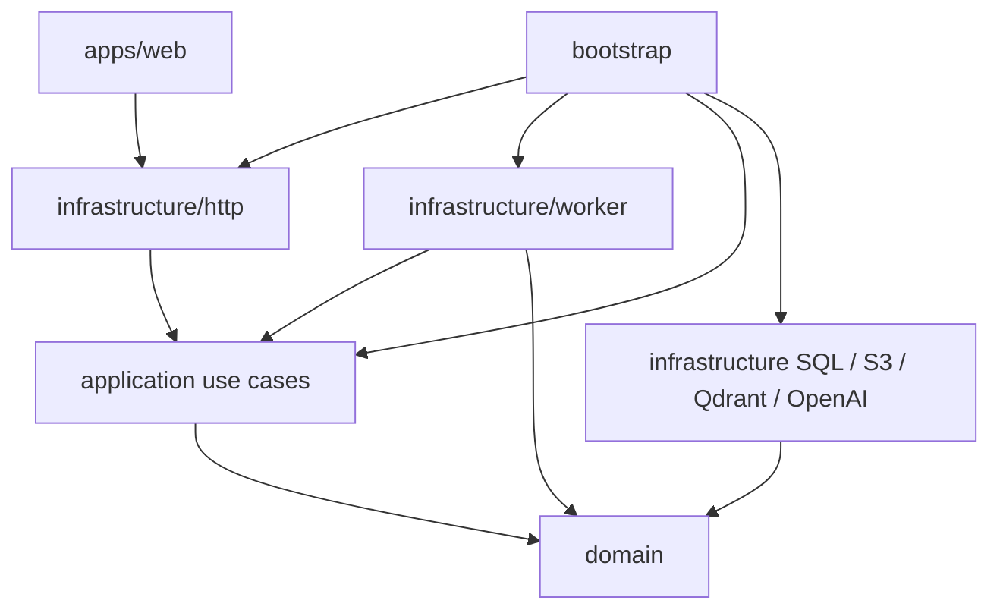
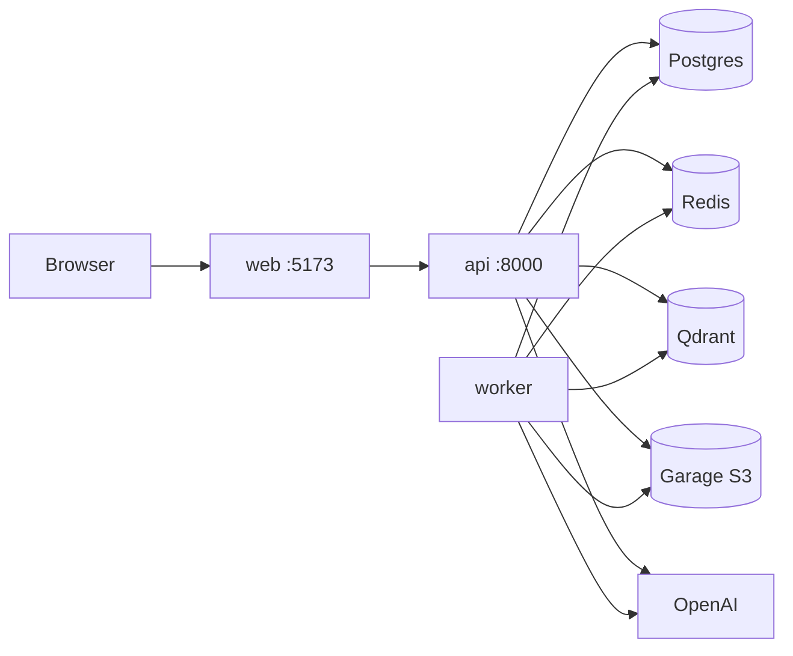
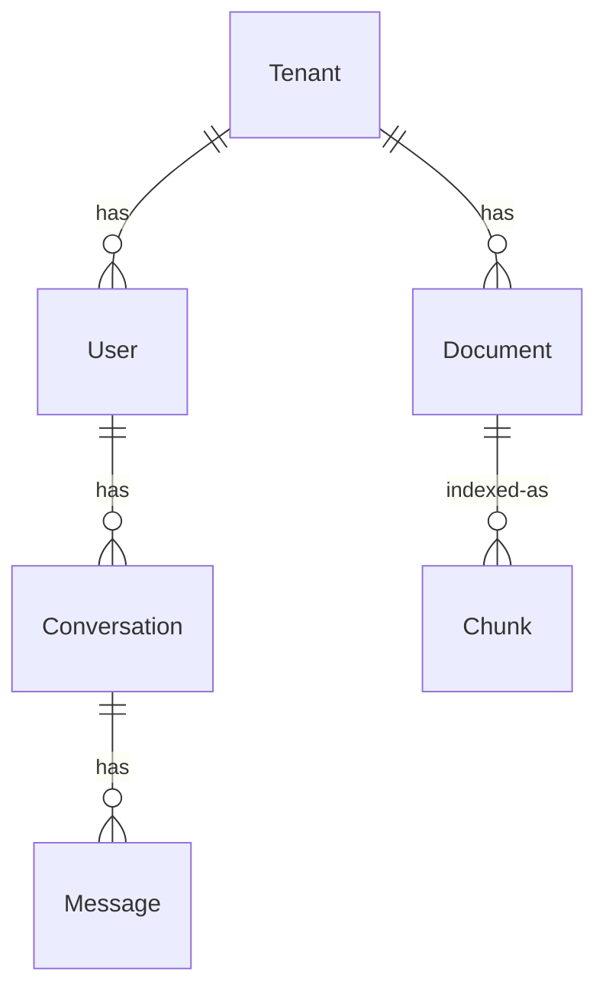

# Architecture diagrams

Adopted from `ARCHITECTURE-SPINE.md`. SPEC.md kernel is prose only; these diagrams are part of the contract.

## Layer dependency



`domain` imports none of FastAPI, SQLAlchemy, Celery, Qdrant, LangChain, OpenAI, boto3, or web. `application` imports `domain` only. `infrastructure` may import `domain` and `application`. `bootstrap` wires everything. `apps/web` talks to the HTTP API only.

## Runtime topology



Compose **today:** `postgres`, `redis`, `qdrant`, `api`, `worker`, `web`. **Add with the documents slice:** `garage` (`dxflrs/garage:v2.4.1`) plus S3 env on `api` and `worker`.

## Domain graph



`Chunk` is a Qdrant point in `chunks`, not a Postgres table. Assistant `Message` carries `SourceRef` (`document_id`, `filename`, `page`, `chunk_index`).

## Directory seed

```text
apps/api/src/app/
  domain/           # entities, VOs, errors, ports
  application/      # use cases by capability
  infrastructure/   # http, persistence, worker, s3, qdrant, openai, config
  bootstrap/        # composition root
apps/web/src/
  api/              # HTTP client
  features/         # UI by feature
```
